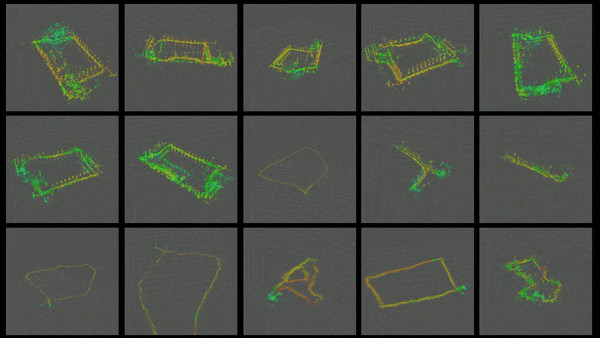

# rio
Graph-based, sparse radar-inertial odometry m-estimation


# Installation
Install [ROS noetic](https://wiki.ros.org/noetic/Installation/Ubuntu).
```
sudo apt install git build-essential python3-rosdep python3-catkin-tools ros-noetic-rqt-multiplot -y
mkdir catkin_ws
cd catkin_ws
mkdir src
catkin init
cd src
git clone https://github.com/ethz-asl/rio.git
git clone https://github.com/ethz-asl/lpp.git
git clone https://github.com/rikba/gtsam_catkin.git
cd ..
rosdep install --from-paths src --ignore-src -r -y
catkin build
```

# Launch
Start RIO in one terminal
```
source ~/catkin_ws/devel/setup.bash
roslaunch rio rio.launch visualization:=true
```

Download an example dataset sequence.
```
```

Replay the bag
```
rosbag play
```

# Supported sensors
| Sensor       | Default topic          | Message type              | Required | Note                              |
| ------------ | ---------------------- | ------------------------- | -------- | --------------------------------- |
| IMU          | /imu/data_raw          | sensor_msgs/Imu           | Yes      |                                   |
| IMU filtered | /imu/data              | sensor_msgs/Imu           | Yes      | for initialization                |
| Radar        | /radar/cfar_detections | sensor_msgs/PointCloud2   | Yes      |                                   |
| Barometer    | /baro/pressure         | sensor_msgs/FluidPressure | No       | Activate in [cfg](./cfg/rio.yaml) |

Radar point cloud format, see also [mav_sensors_ros](https://github.com/ethz-asl/mav_sensors_ros/blob/main/src/radar.cpp#L146-L236).
```
| Field name | Size    |
| ---------- | ------- |
| x          | FLOAT32 |
| y          | FLOAT32 |
| z          | FLOAT32 |
| doppler    | FLOAT32 |
| snr        | INT16   |
| noise      | INT16   |
```

# Paper
Please cite our associated paper

# Video

# Dataset
Please take a look at our shared data set for 15 sequences of urban night, forest path, field, and deep forest handheld and flown data.

