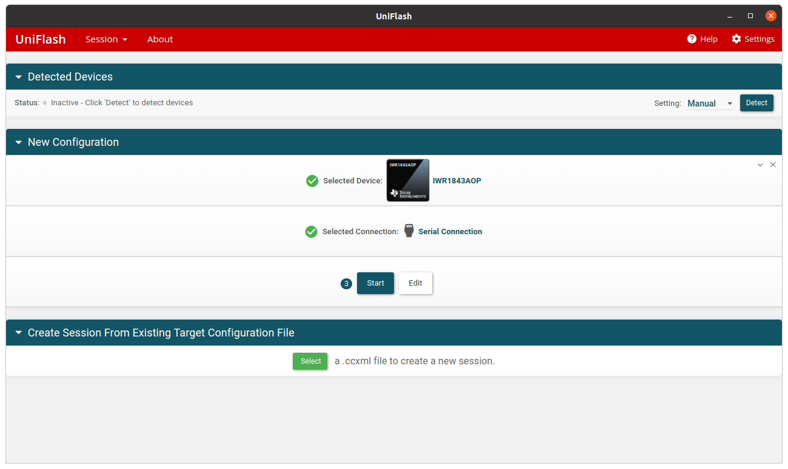
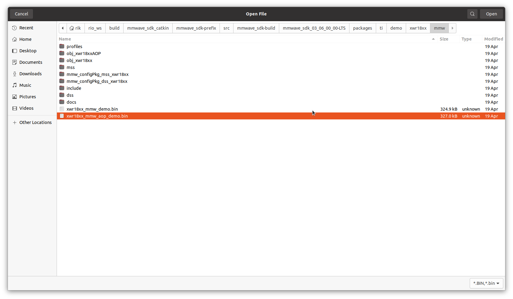
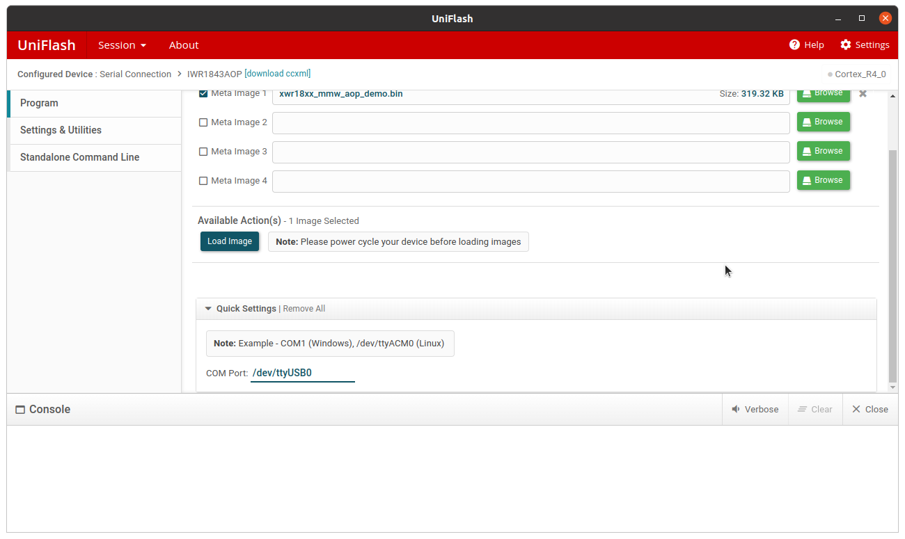
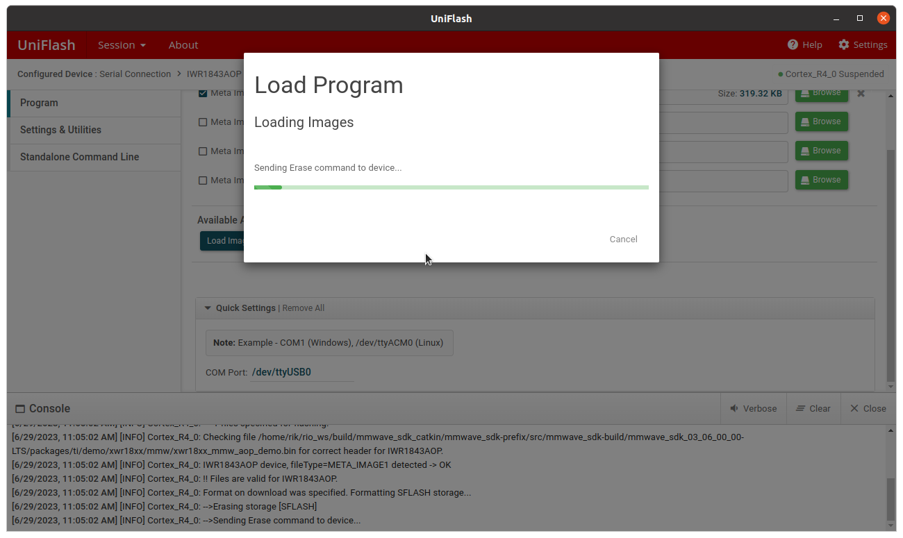
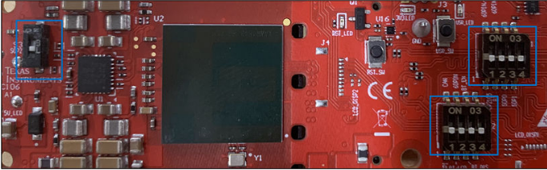
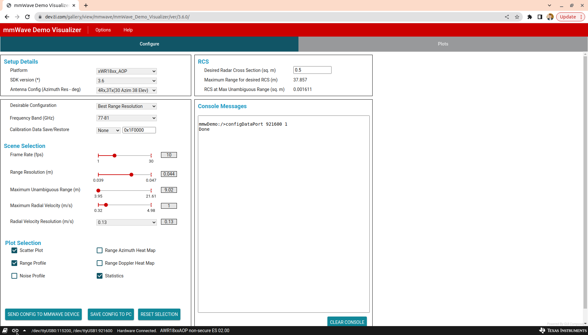
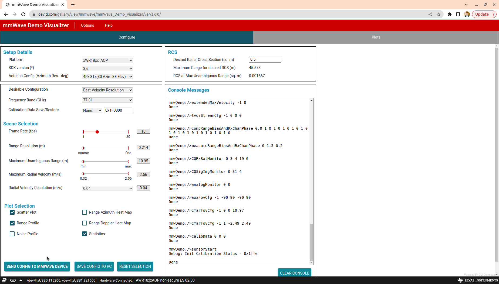
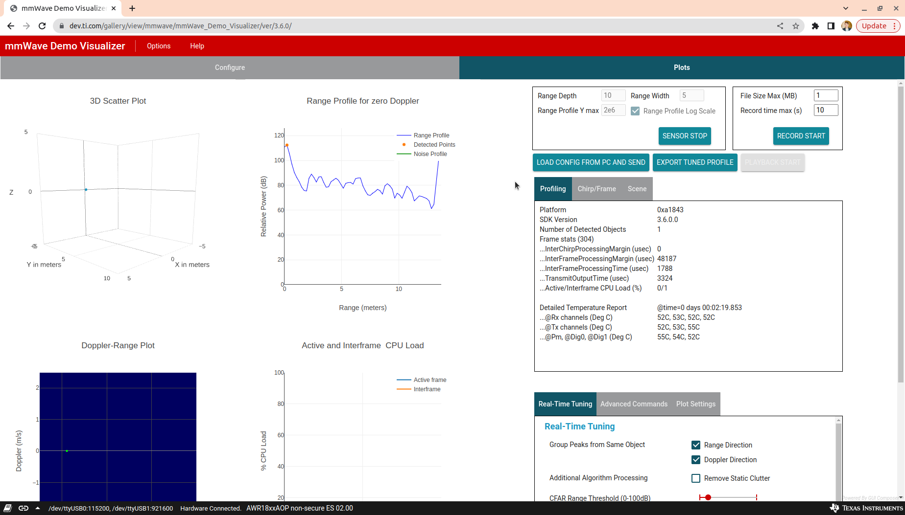

```
sudo dpkg --add-architecture i386
sudo apt install build-essential -y
sudo apt install mono-complete -y
```

```
cd ~/rio_ws/build/mmwave_sdk_catkin/mmwave_sdk-prefix/src/mmwave_sdk-build/mmwave_sdk_03_06_00_00-LTS/packages/scripts/unix
source ./setenv.sh
```

# Update firmware using uniflash
Launch [uniflash](https://dev.ti.com/tirex/explore/content/radar_toolbox_1_10_00_13/docs/software_guides/using_uniflash_with_mmwave.html)
```
~/ti/uniflash_8.2.0/node-webkit/nw ~/ti/uniflash_8.2.0
```

Select IWR1843AOP


Select demo firmware


Select device `/dev/ttyUSB0`


Load image


# Test firmware with [mmWave Demo Visualizer](https://dev.ti.com/mmWaveDemoVisualizer)
Reset device, set S3 low



Connect device in visualizer on bottom left


Send config


View plots

